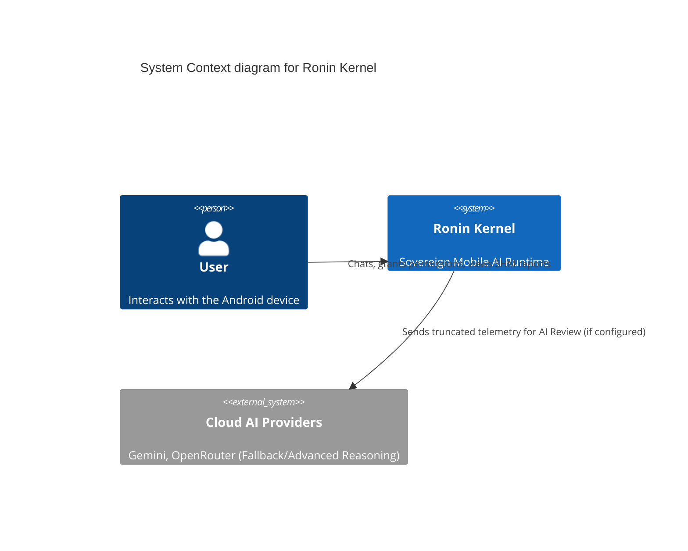

# 2. Architecture Overview

## System Boundaries
The Ronin Kernel is designed with a strict division of labor:
*   **The Android Shell (Kotlin/JNI)**: Responsible for UI (Compose), OS permissions, hardware sensor access (Accelerometer, GPS), and dynamic cloud provider management.
*   **The Native Kernel (C++20)**: Responsible for the cognitive loop, long-term memory, DSP math, decision engines, and capability routing.

## The Cognitive Loop
The system operates on a continuous, interruptible OODA-like loop:
1.  **Observe**: Inject device world-state (battery, location, sensor data).
2.  **Classify**: Determine the user's intent or the system's current state.
3.  **Retrieve**: Fetch relevant memories or semantic knowledge from the local SQLite FTS5 database.
4.  **Plan**: Construct a Directed Acyclic Graph (DAG) of capabilities to execute.
5.  **Execute**: Fire JNI callbacks to access hardware or run internal native logic.
6.  **Adapt**: Evaluate outcomes (Success/Failure) and update Belief States for future routing.

## High-Level Architecture Diagram

