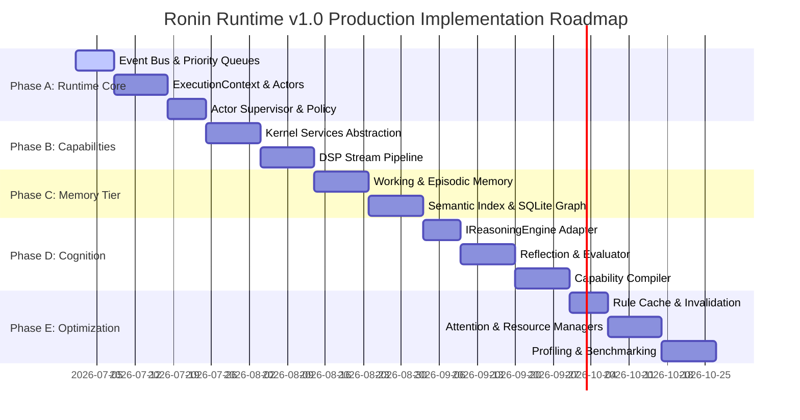

# Ronin Cognitive Runtime v1.0: Production Release Spec & Implementation Blueprint

This document freezes the architectural design scope and establishes the implementation blueprint for the production release of **Ronin Runtime v1.0**. No further architectural layers will be added; focus is shifted entirely to software engineering interfaces, validation, profiling, and resource optimizations on Android.

---

## 1. Unified Operating Architecture (Ronin Runtime v1.0)

```
                            PHYSICAL SENSORS
                       (Mic, IMU, GPS, Bluetooth)
                                   │
                                   ▼
                       Shared Sensor Stream Bus
                                   │
                                   ▼
                            Kernel Services
                 (Location, Audio, Memory, Network)
                                   │
                                   ▼
                        Priority-Based Event Bus
                     (With Correlation ID Routing)
                                   │
                                   ▼
              Attention Manager   <───>   Resource Manager
                                   │
                                   ▼
                           Actor Supervisor
                     (Lifecycle & Crash Recovery)
                                   │
                                   ▼
                            Actor Framework
                 (Sensor, Memory, Planner, Llm Actors)
                                   │
                                   ▼
                            Task Decomposer
                                   │
                                   ▼
                              Plan Engine  <───>  Planner Rule Cache
                                   │                  (Auto-Invalidated)
                                   ▼
                             Policy Engine
                                   │
                                   ▼
                           Execution Context
                                   │
                                   ▼
                             Goal Monitor
                                   │
                                   ▼
                             Reflection
                                   │
                                   ▼
                             Evaluator
                 (Accuracy, Latency, Power, Satisfaction)
                                   │
                                   ▼
                           Meta-Cognition
                                   │
                                   ▼
                 Memory Tier Hierarchy & Semantic Index
               (Working -> Episode Graph -> Knowledge)
                                   │
                                   ▼
                          Capability Compiler
                       (Versioned Macro Rollback)
```

---

## 2. Kernel & Practicality Specifications (v1.0)

### A. Android Device Resource Isolation
To fit the battery and memory constraints of Android (e.g. Mi 11 Lite 5G NE with 8GB RAM), the runtime is compartmentalized into execution lifecycles:

| Tier | Component Group | Activation Lifecycle | Memory Profile |
| :--- | :--- | :--- | :--- |
| **Core Kernel** | Event Bus, Actor Runtime, Scheduler, Policy Engine, World Model, Memory | **Always On** (Runs inside Foreground Service) | Low footprint (~30MB) |
| **Cognitive Layer** | LLM Coprocessor (Gemma), Reflection, Meta-Cognition, Compiler | **On-Demand** (Woken up via Event Bus triggers) | High footprint (Loads weight parameters to RAM, offloads on idle) |
| **Background Layer**| Sensor Bus, DSP pipelines, Attention Manager | **Adaptive** (Frequency throttled by battery status) | Medium footprint (~45MB) |

### B. Standardized Event Schema with Correlation ID
Every system event conforms to a strict struct definition. The `correlation_id` matches the originating `ExecutionContext` to allow tracing execution trees across distributed system actors.

```cpp
namespace Ronin::Kernel::Event {

enum class EventPriority { CRITICAL, HIGH, NORMAL, LOW };

struct Event {
    std::string id;
    std::string type;
    uint64_t timestamp = 0;
    EventPriority priority = EventPriority::NORMAL;
    std::string source;
    std::string payload_json;
    std::string correlation_id; // Connects to ExecutionContext
};

} // namespace Ronin::Kernel::Event
```

### C. Kernel Service Layer
To make Actor code platform-agnostic, actors communicate through an abstract service interface instead of directly executing JNI, SQLite, or AAudio wrappers:

```cpp
namespace Ronin::Kernel::Services {

class ILocationService {
public:
    virtual ~ILocationService() = default;
    virtual std::string getLastKnownLocation() = 0;
};

class IAudioService {
public:
    virtual ~IAudioService() = default;
    virtual void startStreaming(std::function<void(const std::vector<float>&)> callback) = 0;
    virtual void stopStreaming() = 0;
};

class IMemoryService {
public:
    virtual ~IMemoryService() = default;
    virtual void writeEpisode(const std::string& episode_json) = 0;
    virtual std::string queryKnowledge(const std::string& query) = 0;
};

} // namespace Ronin::Kernel::Services
```

### D. Memory Tier Hierarchy & Decay
Memory is managed dynamically to keep the database size stable:
1. **Working Memory**: In-RAM state for the active `ExecutionContext`.
2. **Episodic Memory**: Serialized episode runs stored in SQLite `episodes` table.
3. **Knowledge Graph**: Consolidated facts and semantic associations extracted from episodes.
4. **Archive/Decay**: Old episodes are periodically compressed, pruned, or archived based on relevance scores.

### E. Actor Supervisor Tree
The `ActorSupervisor` acts as a lifecycle monitor. It captures runtime exceptions, manages timeouts, and restarts failed actors based on restart policies:

```cpp
namespace Ronin::Kernel::Execution {

class ActorSupervisor {
public:
    static ActorSupervisor& getInstance();
    void registerActor(std::shared_ptr<Actor> actor);
    void handleCrash(const std::string& actor_id);
    void healthCheck();
    
private:
    std::vector<std::shared_ptr<Actor>> m_monitored_actors;
    std::mutex m_mutex;
};

} // namespace Ronin::Kernel::Execution
```

---

## 3. Production Staged Roadmap


