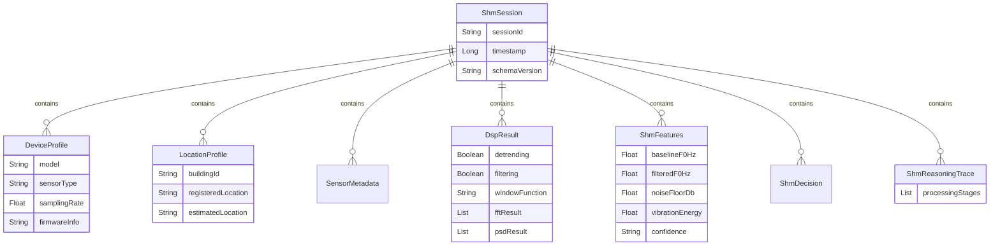

# Ronin SHM Pipeline v3.0 Architecture

This document describes the architectural flow, sequence, and data structures for the Structural Health Monitoring (SHM) subsystem in Ronin v3.0. It encompasses the Native DSP engine, the Modal Validation Engine v3, the Kotlin UI bindings, and the production AI Review Pipeline.

## 1. System Overview

The SHM Pipeline operates across three primary layers:
1. **Native C++ Layer (`vibe_monitor.cpp`)**: Handles high-performance sensor processing, filtering, detrending, and modal validation.
2. **Android UI & State Layer (`ChatViewModel.kt`, `ShmUiComponents.kt`)**: Binds live native telemetry and processed metrics into the Jetpack Compose views.
3. **AI Review & Export Layer (`ShmAiReviewPipeline.kt`, `ShmSession.kt`)**: Structures the final DSP results into engineering JSON, sends payloads to local/cloud LLMs for structural review, and allows for sharing/clipboard copy.

---

## 2. High-Level Data Flow

The following flowchart illustrates how raw sensor data is ingested and processed through the system to become an actionable AI Review.

```mermaid
graph TD
    %% Define Styles
    classDef native fill:#2E1C38,stroke:#AB47BC,color:#FFF,stroke-width:2px;
    classDef kotlin fill:#1B5E20,stroke:#81C784,color:#FFF,stroke-width:2px;
    classDef ai fill:#01579B,stroke:#4FC3F7,color:#FFF,stroke-width:2px;
    classDef ext fill:#424242,stroke:#BDBDBD,color:#FFF,stroke-width:2px;

    %% Data Flow
    subgraph "Native C++ Layer (DSP)"
        S[Sensor Reality (100Hz)] -->|Raw Accel (X,Y,Z)| D[shm_candidate_dumper]
        D -->|DC Detrending| N[Noise Characterization]
        N -->|Welch PSD| P[Parameter Freeze]
        P -->|Config: win=1024, sub=512| MVE[Modal Validation Engine v3]
        MVE -->|Hysteresis & Outlier Gates| O[Decision & JSON Telemetry]
    end

    subgraph "Kotlin Android Layer"
        O -->|JNI / String passing| V[ChatViewModel]
        V -->|Updates State| U[ShmResultCard / ShmDetailScreen]
        V -->|Constructs| SS[ShmSession Data Model]
        SS -->|JSON / Human Report| EX[ExportManager & Clipboard]
    end

    subgraph "AI Review Layer"
        SS -->|Truncated / Cleaned Payload| AIR[ShmAiReviewPipeline]
        AIR -->|Prompt + Data| LM{LLM Engine}
        LM -->|Local Execution| G4E2B[Local Gemma 4 E2B]
        LM -->|Cloud API| GPRO[Cloud Gemini / OpenRouter]
        
        G4E2B -->|Raw Text (LaTeX)| C[cleanLatex() Regex]
        GPRO -->|Raw Text| C
        C -->|Parsed AIReviewResult| U
    end

    %% Apply Styles
    class S,D,N,P,MVE,O native;
    class V,U,SS,EX kotlin;
    class AIR,C ai;
    class G4E2B,GPRO ext;
```

---

## 3. Modal Validation Engine Sequence

The Modal Validation Engine is responsible for filtering out spurious frequencies (scatter) and verifying true structural resonance modes. It ensures F₀ repeatability (CV < 2%).

```mermaid
sequenceDiagram
    autonumber
    participant Sensor as MEMS Accelerometer
    participant VME as VibeMonitorEngine (C++)
    participant MVE as Modal Validation Engine v3
    participant Hysteresis as ShmKalmanFilter (Gates)
    participant Kotlin as ChatViewModel
    participant AI as ShmAiReviewPipeline

    Sensor->>VME: Push 100Hz Batches (X, Y, Z)
    VME->>VME: Apply HP Filter & Detrend
    VME->>VME: Welch PSD (nfft=2048, sub=1024)
    VME->>MVE: Extract Peak Candidates (Stage 1)
    
    rect rgb(46, 28, 56)
        Note right of MVE: Axis Coherence Check
        MVE->>MVE: Merge candidates across X, Y, Z
        MVE->>Hysteresis: Pass merged candidates
        Hysteresis-->>Hysteresis: State: NORMAL -> HYSTERESIS_CANDIDATE
        Hysteresis->>MVE: Reject outliers (e.g. 44Hz)
        Hysteresis-->>Hysteresis: State: HYSTERESIS_CONFIRMED (N >= 6)
    end
    
    MVE->>VME: Final Confirmed Modal Frequencies
    VME->>VME: Compile Reasoning Trace (processing_stages)
    VME->>Kotlin: JNI Emit (JSON String)
    Kotlin->>Kotlin: Update ShmSession (Live binding)
    
    alt User requests AI Review
        Kotlin->>AI: executeReview(ShmSession)
        AI->>AI: Truncate PSD/FFT arrays (Token Optimization)
        AI->>AI: Call Model
        AI->>Kotlin: AIReviewResult (Summary, Observations)
    end
```



---

## 4. `ShmSession` Data Model (ERD)

The `ShmSession` data class acts as the single source of truth for both UI rendering, offline storage, and engineering export.



---

## 5. Key System Guarantees

1. **Token Constraint & Payload Truncation:** Raw FFT and PSD float arrays are excluded or heavily decimated before being sent to Local/Cloud LLMs to respect context window limits and ensure speed.
2. **Dynamic Live Binding:** The UI (Compose `Canvas` for peaks, Text bindings for F₀) reacts instantly to the `ChatViewModel` state changes, ensuring visual fidelity.
3. **Data Immutability:** AI formatting quirks (e.g., LaTeX `$\text{-52 dB}$` outputs) are parsed and sanitized strictly on the UI presentation layer, leaving the underlying raw JSON log untouched.
4. **Copy & Export Integrity:** The system utilizes `LocalClipboardManager` and native Android Intents (`ACTION_SEND`) explicitly rather than implicitly storing large diagnostic strings directly on the OS clipboard, mitigating OEM truncation.
