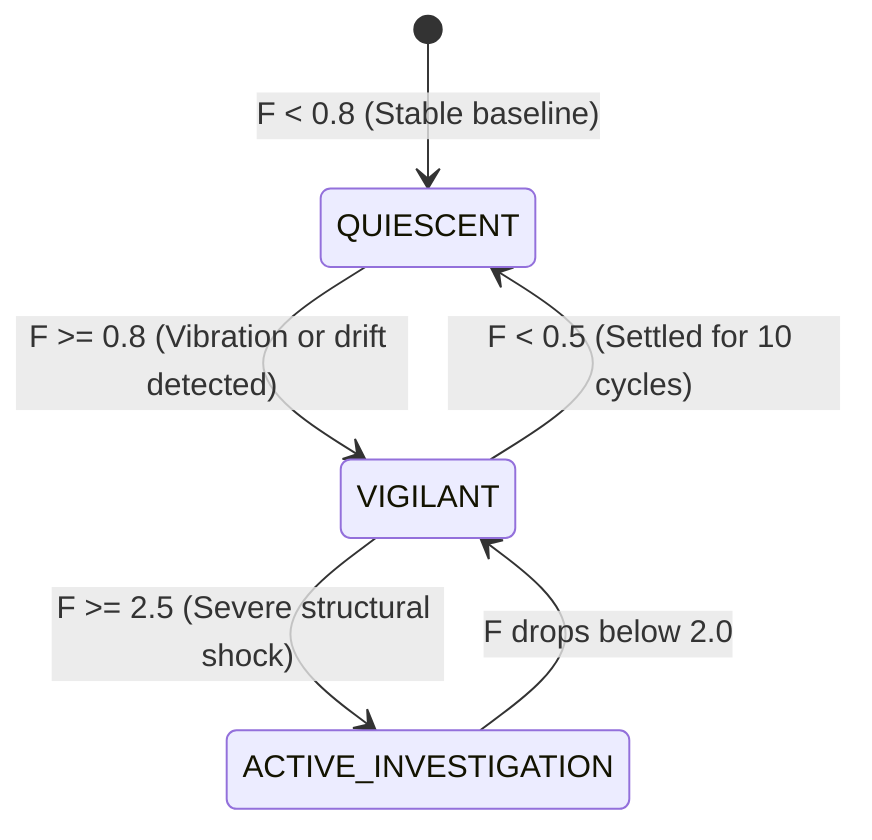

# Ronin Kernel User Guide & Manual (အသုံးပြုသူ လမ်းညွှန်)

Welcome to the official user manual for **Ronin Kernel** — a sovereign, on-device cognitive AI agent and Structural Health Monitoring (SHM) runtime for Android.

Ronin Kernel ၏ အသုံးပြုသူလက်စွဲစာအုပ်မှ ကြိုဆိုပါသည်။ ဤလမ်းညွှန်တွင် Ronin ကို ထည့်သွင်းခြင်း၊ On-device Brain တင်ခြင်း၊ Cloud Providers ချိတ်ဆက်ခြင်း၊ အဆောက်အအုံတုန်ခါမှု တိုင်းတာခြင်း (SHM)၊ ရေရှည်မှတ်ဉာဏ် (LTM) ထိန်းသိမ်းခြင်းနှင့် Backup ရယူနည်းများကို အသေးစိတ် ရှင်းပြထားပါသည်။

---

## မာတိကာ (Table of Contents)

1. [စနစ်မိတ်ဆက် (System Overview)](#၁-စနစ်မိတ်ဆက်-system-overview)
2. [စတင်ထည့်သွင်းခြင်းနှင့် Setup (Installation & Initial Setup)](#၂-စတင်ထည့်သွင်းခြင်းနှင့်-setup-installation--initial-setup)
3. [Brain မော်ဒယ်များနှင့် Cloud စနစ်များ ချိတ်ဆက်ခြင်း (Models & Cloud Providers)](#၃-brain-မော်ဒယ်များနှင့်-cloud-စနစ်များ-ချိတ်ဆက်ခြင်း-models--cloud-providers)
4. [စကားပြောဆိုခြင်းနှင့် စဉ်းစားတွေးခေါ်မှုမှတ်တမ်း (Chat & Reasoning Logs)](#၄-စကားပြောဆိုခြင်းနှင့်-စဉ်းစားတွေးခေါ်မှုမှတ်တမ်း-chat--reasoning-logs)
5. [အဆောက်အအုံကြံ့ခိုင်မှု တိုင်းတာခြင်း (Structural Health Monitoring - SHM)](#၅-အဆောက်အအုံကြံ့ခိုင်မှု-တိုင်းတာခြင်း-structural-health-monitoring---shm)
6. [ဂစ်တာနှင့် တူရိယာ အသံညှိခြင်း (Musical Instrument & Guitar Tuner)](#၆-ဂစ်တာနှင့်-တူရိယာ-အသံညှိခြင်း-musical-instrument--guitar-tuner)
7. [ဖုန်းစနစ်နှင့် Hardware ထိန်းချုပ်မှုများ (Device & Hardware Tools)](#၇-ဖုန်းစနစ်နှင့်-hardware-ထိန်းချုပ်မှုများ-device--hardware-tools)
8. [စာရွက်စာတမ်း ဖတ်ရှုခြင်း၊ အကျဉ်းချုပ်ခြင်းနှင့် OCR (Document Intelligence & OCR)](#၈-စာရွက်စာတမ်း-ဖတ်ရှုခြင်း-အကျဉ်းချုပ်ခြင်းနှင့်-ocr-document-intelligence--ocr)
9. [ကိုယ်ရေးကိုယ်တာ လုံခြုံရေးနှင့် ဒေတာဖုံးကွယ်မှု (Privacy Shield & Data Redaction)](#၉-ကိုယ်ရေးကိုယ်တာ-လုံခြုံရေးနှင့်-ဒေတာဖုံးကွယ်မှု-privacy-shield--data-redaction)
10. [Active Inference နှင့် အာရုံခံကြိမ်နှုန်း ချိန်ညှိမှု (RAIK & Developer HUD)](#၁၀-active-inference-နှင့်-အာရုံခံကြိမ်နှုန်း-ချိန်ညှိမှု-raik--developer-hud)
11. [ရေရှည်မှတ်ဉာဏ်နှင့် လုံခြုံရေး Vault (Long-Term Memory & Vault)](#၁၁-ရေရှည်မှတ်ဉာဏ်နှင့်-လုံခြုံရေး-vault-long-term-memory--vault)
12. [မှတ်ဉာဏ် Backup ရယူခြင်းနှင့် အသစ်ပြန်တင်ခြင်း (Disaster Recovery & Backup)](#၁၂-မှတ်ဉာဏ်-backup-ရယူခြင်းနှင့်-အသစ်ပြန်တင်ခြင်း-disaster-recovery--backup)
13. [အမြန်သုံး Command များ (Slash Commands Reference)](#၁၃-အမြန်သုံး-command-များ-slash-commands-reference)
14. [မကြာခဏမေးလေ့ရှိသော မေးခွန်းများနှင့် ဖြေရှင်းနည်းများ (FAQ & Troubleshooting)](#၁၄-မကြာခဏမေးလေ့ရှိသော-မေးခွန်းများနှင့်-ဖြေရှင်းနည်းများ-faq--troubleshooting)

---

## ၁။ စနစ်မိတ်ဆက် (System Overview)

Ronin သည် အင်တာနက်မလိုဘဲ ဖုန်းထဲတွင် သီးသန့်အလုပ်လုပ်နိုင်သော Native C++20 Cognitive Microkernel ဖြစ်ပြီး Android စနစ်နှင့် တိုက်ရိုက် ပေါင်းစပ်ထားပါသည်။

### အဓိက စွမ်းဆောင်ရည်များ (Core Capabilities):
* **On-Device Local AI**: Google LiteRT-LM (Gemma 4) မော်ဒယ်များကို ဖုန်းထဲတွင် offline အပြည့်အဝ run နိုင်ခြင်း။
* **Hybrid Cloud Fallback**: Gemini, OpenAI, OpenRouter နှင့် မိမိစိတ်ကြိုက် Cloud API များကို အချိန်မရွေး ပြောင်းလဲအသုံးပြုနိုင်ခြင်း။
* **Structural Health Monitoring (SHM)**: 3-Axis Accelerometer နှင့် 2048-pt Welch Fast Fourier Transform (FFT) အသုံးပြု၍ အဆောက်အအုံ၊ တံတားနှင့် စက်ပစ္စည်းများ၏ တုန်ခါမှုကြိမ်နှုန်း (Resonance Frequency) ကို 0.05 Hz တိကျမှုဖြင့် တိုင်းတာစစ်ဆေးပေးနိုင်ခြင်း။
* **Musical Instrument & Guitar Tuner**: ဖုန်းမိုက်ခရိုဖုန်းမှတစ်ဆင့် အသံလှိုင်း (PCM Audio) ကို ဖမ်းယူပြီး Fast Fourier Transform (FFT) နှင့် Peak Detection ဖြင့် ဂစ်တာကြိုး (E2, A2, D3, G3, B3, E4) နှင့် အခြားတူရိယာများကို Visual Cent Meter အပ်တံဖြင့် တိကျစွာ အသံညှိပေးနိုင်ခြင်း။
* **Device Control Tools**: ဖုန်းဓာတ်မီး (Flashlight)၊ Wi-Fi၊ Bluetooth၊ GPS တည်နေရာ၊ ဖိုင်ရှာဖွေခြင်း (File Search)၊ မက်ဆေ့ခ်ျ (SMS) ပို့ခြင်းများကို AI မှ အလိုအလျောက် ခိုင်းစေနိုင်ခြင်း။
* **Long-Term Memory (LTM)**: စကားပြောဆိုမှုများ၊ အရေးကြီး အချက်အလက် (Facts) များကို SQLite FTS5 lexical search ဖြင့် အမြဲတမ်း မှတ်သားထားနိုင်ခြင်း။
* **Disaster Recovery**: App ကို update သို့မဟုတ် reinstall လုပ်သည့်အခါ မူလမှတ်ဉာဏ်များ မပျောက်စေရန် တစ်ချက်နှိပ်ရုံဖြင့် Downloads ထဲသို့ Backup ထုတ်ပေးနိုင်ခြင်း။

---

## ၂။ စတင်ထည့်သွင်းခြင်းနှင့် Setup (Installation & Initial Setup)

### APK ထည့်သွင်းခြင်း
1. GitHub Releases သို့မဟုတ် GitHub Actions Artifact မှ `ronin-kernel-app-debug.apk` ကို ဒေါင်းလုဒ်ရယူပါ။
2. APK ကို ဖွင့်၍ "Install" (သို့မဟုတ် ရှိပြီးသားအပေါ်မှ "Update") ပြုလုပ်ပါ။
   *(မှတ်ချက် - Ronin တွင် ပုံသေ Deterministic Keystore သုံးထားသောကြောင့် နောင်ထွက်မည့် version များကို uninstall လုပ်စရာမလိုဘဲ အပေါ်ကနေ တိုက်ရိုက် Update တင်နိုင်ပါသည်)*

### လိုအပ်သော Permissions များ ခွင့်ပြုပေးခြင်း
App ကို ပထမဆုံးဖွင့်သည့်အခါ အောက်ပါ permission များကို လိုအပ်သလို ခွင့်ပြုပေးပါ-
* **Microphone (Audio)**: ဂစ်တာနှင့် တူရိယာ အသံကြိမ်နှုန်း ဖမ်းယူရန် (Guitar tuner & audio pitch analysis)။
* **Location (GPS)**: အနီးအနား တည်နေရာနှင့် မြေပုံအချက်အလက် ရယူရန်။
* **Camera / Flashlight**: ဓာတ်မီး အဖွင့်/အပိတ် ထိန်းချုပ်ရန်။
* **Storage / All Files Access**: ဒေသတွင်း ဖိုင်များကို ရှာဖွေနိုင်ရန်နှင့် Brain Model (.litertlm) များ တင်သွင်းရန်။
* **SMS / Contacts**: မက်ဆေ့ခ်ျပို့ခြင်းနှင့် ဖုန်းနံပါတ်ရှာဖွေရန် (ခွင့်ပြုချက်တောင်းခံသည့်အခါ အမြဲတမ်း အတည်ပြုချက် မေးမြန်းပါမည်)။

---

## ၃။ Brain မော်ဒယ်များနှင့် Cloud စနစ်များ ချိတ်ဆက်ခြင်း (Models & Cloud Providers)

Ronin သည် ဒေသတွင်း On-device Model သို့မဟုတ် Cloud Provider တစ်ခုခု (သို့မဟုတ် နှစ်ခုစလုံး) ဖြင့် အလုပ်လုပ်နိုင်ပါသည်။

### နည်းလမ်း (က) - Local Brain Model တင်သွင်းနည်း (.litertlm)
1. ဘယ်ဘက်အပေါ်ထောင့်ရှိ **Menu (☰)** ကို နှိပ်ပြီး Settings ထဲသို့ ဝင်ပါ။
2. **Section 4: Local Brain** သို့ ဆင်းပါ။
3. **Import Brain (.litertlm)** ခလုတ်ကို နှိပ်ပြီး ဖုန်းထဲရှိ LiteRT-LM Format မော်ဒယ်ဖိုင် (ဥပမာ - `gemma-2b-it.litertlm` သို့မဟုတ် `.bin`) ကို ရွေးချယ်ပေးပါ။
4. Model Hydration အောင်မြင်ပါက အစိမ်းရောင်ဖြင့် "Kernel Ready" ဖြစ်သွားပါမည်။

### နည်းလမ်း (ခ) - Cloud Provider (Gemini / OpenAI / OpenRouter) ချိတ်ဆက်နည်း
ဒေသတွင်း Local Model မရှိပါကလည်း Cloud စနစ်ဖြင့် အလွယ်တကူ သုံးနိုင်ပါသည်-
1. Settings > **Section 3: Cloud Providers** သို့ သွားပါ။
2. **Add Cloud Provider** ကို နှိပ်ပါ။
3. မိမိသုံးလိုသော အမျိုးအစား (Gemini, OpenAI, OpenRouter သို့မဟုတ် Custom) ကို ရွေးပါ။
4. မိမိ၏ **API Key** ကို ရိုက်ထည့်ပြီး သိမ်းဆည်းပါ။
5. **Ping** ခလုတ်ကို နှိပ်၍ ချိတ်ဆက်မှု အဆင်ပြေကြောင်း စမ်းသပ်နိုင်ပါသည်။
6. Settings > Section 1 တွင် **Cloud Only Mode** ကို ဖွင့်ထားပါက အင်တာနက်မှတစ်ဆင့်သာ တိုက်ရိုက် အမြန်ဆုံး ဉာဏ်ရည်တု အဖြေများကို ထုတ်ပေးပါမည်။

---

## ၄။ စကားပြောဆိုခြင်းနှင့် စဉ်းစားတွေးခေါ်မှုမှတ်တမ်း (Chat & Reasoning Logs)

* **ဘာသာစကား ပံ့ပိုးမှု**: Ronin သည် မြန်မာစာ (Unicode) နှင့် အင်္ဂလိပ်စာ နှစ်မျိုးစလုံးကို သဘာဝကျကျ နားလည်ပြီး ပြန်လည်ဖြေကြားပေးနိုင်ပါသည်။
* **Reasoning Console (အတွင်းပိုင်း တွေးခေါ်မှုပြသခြင်း)**:
  - Ronin သည် အဖြေမထုတ်မီ အတွင်းပိုင်းတွင် စဉ်းစားတွေးခေါ်မှု (Chain-of-Thought) ကို `[THINK] ... [/THINK]` block ဖြင့် ပြုလုပ်ပါသည်။
  - အပေါ်ဘက် TopBar ရှိ **မျက်လုံးပုံ Icon** ကို နှိပ်၍ အဆိုပါ တွေးခေါ်မှုအဆင့်ဆင့်ကို အချိန်နှင့်တပြေးညီ ကြည့်ရှုနိုင်ပါသည်။
* **ဆက်လက်ရေးသားခိုင်းခြင်း (Continue)**:
  - ရှည်လျားသော အဖြေများ ရေးသားနေစဉ် တုံ့ဆိုင်းသွားပါက ကတ်အောက်ခြေရှိ **"ဆက်ရေးပါ (Continue)"** ခလုတ်ကို နှိပ်၍ ဆက်လက် ရေးခိုင်းနိုင်ပါသည်။

---

## ၅။ အဆောက်အအုံကြံ့ခိုင်မှု တိုင်းတာခြင်း (Structural Health Monitoring - SHM)

Ronin တွင် ကမ္ဘာ့အဆင့်မီ တုန်ခါမှုဆိုင်ရာ အချက်ပြတွက်ချက်မှု (Modal Validation Engine v3 & Welch FFT) ပါဝင်ပါသည်။

### မည်သို့ တိုင်းတာရမည်နည်း?
1. ဖုန်းကို တုန်ခါမှုတိုင်းတာလိုသော ကြမ်းပြင်၊ စားပွဲ၊ တိုင် သို့မဟုတ် စက်ယန္တရားမျက်နှာပြင်ပေါ်တွင် လှုပ်ရှားမှုမရှိအောင် ငြိမ်သက်စွာ ချထားပါ။
2. စကားပြောဆိုမှုတွင် အောက်ပါအတိုင်း မေးမြန်း/ခိုင်းစေပါ-
   - `"တုန်ခါမှု စစ်ဆေးပေးပါ"`
   - `"အဆောက်အအုံ ကြံ့ခိုင်မှု စစ်ပေးပါ"`
   - `"Check structural vibration"`
3. Ronin သည် Accelerometer မှ အချက်အလက်များကို 100Hz ဖြင့် နမူနာ 1024 ခု (၁၀.၂ စက္ကန့်စာ) တိုင်းတာပြီး High-Pass Filter ဖြင့် မြေဆွဲအား (Gravity DC) ကို ဖယ်ရှားကာ Fast Fourier Transform (FFT) တွက်ချက်ပါမည်။
4. **ရလဒ်များတွင် အောက်ပါတို့ကို တွေ့ရပါမည်**:
   - **Dominant Resonance Frequency (Hz)**: အဓိက တုန်ခါကြိမ်နှုန်း (ဥပမာ - 4.5 Hz သို့မဟုတ် 12.8 Hz)။
   - **Quality Factor (Q)** & **SNR (dB)**: လှိုင်း၏ သန့်စင်မှုနှင့် ပြတ်သားမှု။
   - **Modal Confidence Score**: တုန်ခါမှု အချက်အလက် ခိုင်မာမှု ရာခိုင်နှုန်း။
   - **Multi-Axis Coherence**: X, Y, Z မျက်နှာပြင် ၃ ခုစလုံးတွင် တွေ့ရှိရမှု။
5. **Export ပြုလုပ်ခြင်း**:
   - ရလဒ်အောက်ခြေရှိ **"Export JSON"** သို့မဟုတ် **"Export Report"** ကို နှိပ်၍ အင်ဂျင်နီယာအစီရင်ခံစာအဖြစ် ထုတ်ယူနိုင်ပါသည်။

---

## ၆။ ဂစ်တာနှင့် တူရိယာ အသံညှိခြင်း (Musical Instrument & Guitar Tuner)

Ronin တွင် အသံလှိုင်း အချက်ပြစနစ် (Audio DSP) အသုံးပြု၍ ဂစ်တာနှင့် တူရိယာကြိုးများကို အချိန်နှင့်တပြေးညီ တိကျစွာ အသံညှိပေးနိုင်သော **Native Instrument Tuner** ပါဝင်ပါသည်။

### အလုပ်လုပ်ပုံ နည်းပညာ အကျဉ်းချုပ် (Technical Architecture):
1. **Audio Capture**: ဖုန်း၏ မိုက်ခရိုဖုန်းမှတစ်ဆင့် 8000 Hz Sample Rate ဖြင့် အသံလှိုင်း နမူနာများကို ဖမ်းယူပါသည်။
2. **Native DSP Analysis**: C++20 DSP Engine က Fast Fourier Transform (FFT) တွက်ချက်ပြီး Peak Detection ဖြင့် အဓိက အသံလှိုင်းကြိမ်နှုန်း (Fundamental Pitch Frequency in Hz) ကို ထုတ်ယူပါသည်။
3. **Note & Cent Mapping**: ရရှိလာသော Hz ကို စံသတ်မှတ် ဂီတသံစဉ်အဖြစ် $n = 12 \times \log_2(f / 440) + 69$ ဖြင့် တွက်ချက်ကာ အနီးစပ်ဆုံး ဂစ်တာကြိုးနှင့် ကွဲလွဲချက် (Cent Deviation) ကို ရှာဖွေပေးပါသည်။

---

### ဂစ်တာကြိုး စံသတ်မှတ်ကြိမ်နှုန်းများ (Standard Guitar Tuning - EADGBE):
| ကြိုးနံပါတ် | ကြိုးအမည် | စံသတ်မှတ်ကြိမ်နှုန်း (Target Hz) | မှတ်ချက် |
| :---: | :---: | :---: | :--- |
| **ကြိုး (၆)** | **E2** | 82.41 Hz | အကြီးဆုံးဘေ့စ်ကြိုး (Low E) |
| **ကြိုး (၅)** | **A2** | 110.00 Hz | A ကြိုး |
| **ကြိုး (၄)** | **D3** | 146.83 Hz | D ကြိုး |
| **ကြိုး (၃)** | **G3** | 196.00 Hz | G ကြိုး |
| **ကြိုး (၂)** | **B3** | 246.94 Hz | B ကြိုး |
| **ကြိုး (၁)** | **E4** | 329.63 Hz | အသေးဆုံးကြိုး (High E) |

> [!NOTE]
> ဂစ်တာအပြင် Violin (G3, D4, A4, E5)၊ Ukulele (G4, C4, E4, A4) နှင့် Bass Guitar (E1, A1, D2, G2) တို့၏ Tuning Profiles များကိုလည်း Native DSP အင်ဂျင်က ထောက်ပံ့ပေးထားပါသည်။

---

### စတင်အသုံးပြုနည်း (How to Use):
Chat Box ထဲတွင် အောက်ပါအတိုင်း သာမန်စကားပြောသကဲ့သို့ ပြောဆို၍ Tuner ကို ဖွင့်နိုင်ပါသည်-
* `"ဂစ်တာ အသံညှိပေးပါ"` သို့မဟုတ် `"ဂစ်တာ ကြိုးညှိမယ်"`
* `"guitar tuner"` သို့မဟုတ် `"tune my guitar"`
* `"guitar tuner run"` သို့မဟုတ် `"run note mapper"`

### မျက်နှာပြင်ပေါ်ရှိ Visual Tuner Card အချက်အလက်များ:
အသံညှိနေစဉ် Chat ထိပ်ပိုင်းတွင် **🎸 GUITAR TUNER** Card ပေါ်လာမည်ဖြစ်ပြီး အောက်ပါတို့ကို ပြသပေးပါမည်-
* **Target String**: အနီးစပ်ဆုံး ညှိရမည့် ကြိုးအမည် (ဥပမာ - `E4 target`)။
* **DETECTED**: ဖုန်းမိုက်မှ ဖမ်းယူရရှိသော ကြိမ်နှုန်းနှင့် Note (ဥပမာ - `329.63Hz (E4)`)။
* **TARGET**: စံသတ်မှတ်ထားသော မူရင်းကြိမ်နှုန်း (ဥပမာ - `329.63Hz (E4)`)။
* **Deviation Label & Colors**:
  - **✅ IN TUNE (အစိမ်းရောင်)**: အသံတိကျစွာ တူညီသွားခြင်း ($\pm 5.0$ Cents အတွင်း)။ ဖုန်းမှ Haptic တုန်ခါမှုဖြင့် အသိပေးပါမည်။
  - **🔺 SHARP (အနီရောင်)**: အသံမြင့်လွန်းနေသဖြင့် ကြိုးကို လျှော့ပေးရန် လိုအပ်ခြင်း (`+X.X¢ SHARP`)။
  - **🔻 FLAT (အပြာရောင်)**: အသံနိမ့်လွန်းနေသဖြင့် ကြိုးကို တင်းပေးရန် လိုအပ်ခြင်း (`-X.X¢ FLAT`)။
* **Visual Cent Needle (အပ်တံ Meter)**: ဗဟိုတည့်တည့်သို့ ရောက်ရှိစေရန် အချိန်နှင့်တပြေးညီ ပြသပေးသော တိုင်းတာမှုတန်း။

*(မှတ်ချက် - မိုက်ခရိုဖုန်း အသံတိတ်နေပါက စနစ်က Smooth Frequency Simulation ဖြင့် အလိုအလျောက် သရုပ်ပြ စမ်းသပ်ပေးပါသည်)*

---

## ၇။ ဖုန်းစနစ်နှင့် Hardware ထိန်းချုပ်မှုများ (Device & Hardware Tools)

Ronin အား ဖုန်းတွင်း လုပ်ဆောင်ချက်များကို သာမန်စကားပြောသကဲ့သို့ ခိုင်းစေနိုင်ပါသည်-

| လုပ်ဆောင်ချက် | စမ်းသပ်ခိုင်းနိုင်သော စကားစုများ |
| :--- | :--- |
| **ဓာတ်မီး (Flashlight)** | `"ဓာတ်မီး ဖွင့်ပေးပါ"`, `"မီးပိတ်လိုက်တော့"`, `"Turn on flashlight"` |
| **Wi-Fi** | `"Wi-Fi ဖွင့်ပါ"`, `"ဝိုင်ဖိုင် ပိတ်လိုက်"`, `"Toggle WiFi"` |
| **Bluetooth** | `"Bluetooth ဖွင့်ပါ"`, `"ဘလူးတု ပိတ်ပေး"`, `"Turn on Bluetooth"` |
| **တည်နေရာ (GPS)** | `"ငါ အခု ဘယ်ရောက်နေလဲ"`, `"Show my location coordinates"` |
| **ဖိုင်ရှာဖွေခြင်း** | `"ဖုန်းထဲက PDF တွေ ရှာပေးပါ"`, `"Find invoice documents"` |
| **မက်ဆေ့ခ်ျ (SMS)** | `"0912345678 ကို နေကောင်းလားလို့ မက်ဆေ့ခ်ျပို့ပေးပါ"` *(ခွင့်ပြုချက်တောင်းခံပါမည်)* |
| **အဆက်အသွယ် (Contacts)** | `"U Ba ရဲ့ ဖုန်းနံပါတ် ရှာပေးပါ"`, `"Find contact John"` |

---

## ၈။ စာရွက်စာတမ်း ဖတ်ရှုခြင်း၊ အကျဉ်းချုပ်ခြင်းနှင့် OCR (Document Intelligence & OCR)

Ronin သည် ဖုန်းတွင်းရှိ စာရွက်စာတမ်းများနှင့် ဓာတ်ပုံများကို ဖတ်ရှုနိုင်သော **Personal Document AI Assistant** အဖြစ် အဆင့်မြှင့်တင်ထားပါသည်။

### 📎 Attachment Picker ဖြင့် ဖိုင်နှင့် ဓာတ်ပုံ ရွေးချယ်ခြင်း
Chat Input Bar ဘေးရှိ **📎 (Clip Icon)** ခလုတ်ကို နှိပ်လိုက်ပါက အောက်ပါ ရွေးချယ်စရာ ၂ ခု ပေါ်လာပါမည်-
1. **🖼️ Gallery / Photos (OCR)**:
   - Android System Photo Picker (`PickVisualMedia`) ကို အသုံးပြုထားသဖြင့် `READ_MEDIA_IMAGES` သို့မဟုတ် Storage Permission ပေးစရာ မလိုဘဲ System Gallery မှ ဓာတ်ပုံများကို လုံခြုံစွာ ရွေးချယ်နိုင်ပါသည်။
   - ဘောက်ချာ၊ ပြေစာ၊ မှတ်ပုံတင်၊ ဆိုင်းဘုတ် သို့မဟုတ် စာရွက်စာတမ်း ဓာတ်ပုံများကို ရွေးချယ်လိုက်သည်နှင့် Google ML Kit နှင့် အဆင့်မြင့် စာဖတ်အင်ဂျင်တို့ဖြင့် မြန်မာစာ (Unicode) နှင့် အင်္ဂလိပ်စာသားများကို အလိုအလျောက် စက္ကန့်ပိုင်းအတွင်း ဖတ်ရှုထုတ်ယူ (OCR) ပေးပါမည်။
2. **📁 Browse Documents**:
   - Android Storage Access Framework (`OpenDocument`) ဖြင့် ဖုန်း၏ Internal Storage, SD Card, Download Folder သို့မဟုတ် Google Drive ထဲရှိ PDF, Markdown, Text, Code (`.pdf`, `.md`, `.txt`, `.json`, `.py`, `.doc`) စသည့် ဖိုင်များကို စိတ်ကြိုက် ရှာဖွေရွေးချယ်နိုင်ပါသည်။

---

### Interactive `FileResultCard` အသုံးပြုပုံ
ဖိုင်တစ်ခုကို ရွေးချယ်လိုက်သည့်အခါ သို့မဟုတ် `/files` ဖြင့် ရှာတွေ့သည့်အခါ အပြန်အလှန် နှိပ်နိုင်သော Card ပေါ်လာပြီး အောက်ပါ လုပ်ဆောင်ချက် ၅ မျိုးကို တစ်ချက်နှိပ်ရုံဖြင့် အသုံးပြုနိုင်ပါသည်-

```text
┌──────────────────────────────────────────────────────────────┐
│ 📄 quarterly_financial_report.pdf                            │
│ /storage/emulated/0/Documents • 1.4 MB                       │
│                                                              │
│ [📂 Open] [✉️ Share] [📋 Copy] [📝 Summary] [🔍 OCR]          │
└──────────────────────────────────────────────────────────────┘
```

1. **📂 Open (ဖိုင်ဖွင့်ဖတ်ခြင်း)**: Android `FileProvider` မှတစ်ဆင့် ဖုန်းထဲရှိ Default PDF Viewer သို့မဟုတ် စာဖတ် App ဖြင့် ဖိုင်ကို တိုက်ရိုက် ဖွင့်လှစ်ပေးပါသည်။
2. **✉️ Share (ဖိုင်မျှဝေခြင်း / အီးမေးလ်ပို့ခြင်း)**: Android System ShareSheet ကို ဖွင့်ပေးပြီး Gmail, Telegram, Viber သို့မဟုတ် အခြား App များသို့ ဖိုင် attachment အဖြစ် တိုက်ရိုက် ပို့ဆောင်မျှဝေနိုင်ပါသည်။
3. **📋 Copy (ဖိုင်လမ်းကြောင်း ကူးယူခြင်း)**: ဖိုင်၏ အပြည့်အစုံ လမ်းကြောင်း (Absolute Path) ကို ဖုန်း၏ Clipboard ထဲသို့ ကူးယူပေးပါသည်။
4. **📝 Summary (AI ဖြင့် အနှစ်ချုပ်ခိုင်းခြင်း)**: ဖိုင်ထဲမှ အကြောင်းအရာများကို ဖတ်ရှုပြီး On-Device Gemma 4 မော်ဒယ်ဖြင့် မြန်မာ/အင်္ဂလိပ်လို အဓိက အနှစ်ချုပ် (Bullet Points) များကို ချက်ချင်း ထုတ်ပေးပါသည်။
5. **🔍 OCR (စာသားထုတ်ယူခြင်း)**: ဓာတ်ပုံ သို့မဟုတ် PDF စာမျက်နှာများထဲမှ စာလုံးများကို OCR Engine ဖြင့် ထုတ်ယူပေးပြီး Chat ထဲတွင် တိုက်ရိုက် ပြသပေးပါသည်။

---

### အမြန်သုံး စာရွက်စာတမ်း Command များ
* `/files <keyword>` သို့မဟုတ် `/search <keyword>`: ဖုန်းထဲရှိ ဖိုင်အမည်များကို SQLite FTS5 စနစ်ဖြင့် အလွန်မြန်ဆန်စွာ ရှာဖွေပေးပြီး `FileResultCard` များအဖြစ် ပြသပေးခြင်း။
* `/summarize <file_path>`: သတ်မှတ်ထားသော ဖိုင်ကို ဖတ်ရှုကာ အနှစ်ချုပ် ချက်ချင်း ပြုလုပ်ပေးခြင်း။
* `/docsearch <file_path> <query>`: စာမျက်နှာ ရာချီရှိသော စာအုပ်/စာချုပ်ကြီးများထဲမှ မိမိသိလိုသော စကားလုံး/အကြောင်းအရာ ပါဝင်သည့် အပိုဒ်များကိုသာ ကွက်၍ ရှာဖွေပေးခြင်း။

---

## ၉။ ကိုယ်ရေးကိုယ်တာ လုံခြုံရေးနှင့် ဒေတာဖုံးကွယ်မှု (Privacy Shield & Data Redaction)

အသုံးပြုသူ၏ အရေးကြီး ကိုယ်ရေးကိုယ်တာ အချက်အလက်များ Cloud သို့ မရောက်ရှိစေရန်နှင့် စက်တွင်း၌ပင် အပြည့်အဝ ကာကွယ်နိုင်ရန် Ronin တွင် **Privacy Shield Engine** ထည့်သွင်းထားပါသည်။

### အလိုအလျောက် ဒေတာဖုံးကွယ်ပေးသော အမျိုးအစားများ (PII Redaction):
1. **မြန်မာနိုင်ငံသား စိစစ်ရေးကတ်ပြားအမှတ်များ (NRC)**:
   - ဥပမာ - `၁၂/လမန(နိုင်)၁၂၃၄၅၆` သို့မဟုတ် `12/LAMANA(N)123456` $\longrightarrow$ `[NRC_REDACTED]`
2. **ဖုန်းနံပါတ်များ (Phone Numbers)**:
   - ဥပမာ - `0912345678`, `+959123456789` $\longrightarrow$ `[PHONE_REDACTED]`
3. **အီးမေးလ်လိပ်စာများ (Email Addresses)**:
   - ဥပမာ - `user@example.com` $\longrightarrow$ `[EMAIL_REDACTED]`
4. **ဘဏ်အကောင့်နှင့် ကတ်နံပါတ်များ (Bank / Card Numbers)**:
   - ဥပမာ - `4111 2222 3333 4444` $\longrightarrow$ `[ACCOUNT_REDACTED]`

### Privacy Shield အသုံးပြုနည်း:
* **အဖွင့်/အပိတ် ပြုလုပ်ခြင်း**: Chat မျက်နှာပြင် အပေါ်ဘက်ရှိ **🛡️ Privacy Shield Icon** (သို့မဟုတ် Settings ထဲရှိ Switch) ကို နှိပ်၍ အချိန်မရွေး အဖွင့်/အပိတ် ပြုလုပ်နိုင်ပါသည်။
* **အကာအကွယ်ပေးပုံ**: ဖွင့်ထားချိန်တွင် OCR မှ ထွက်လာသော စာသားများ သို့မဟုတ် Cloud သို့ မေးမြန်းသော မေးခွန်းများထဲတွင် ကိုယ်ရေးကိုယ်တာ အချက်အလက်များ ပါဝင်နေပါက On-Device Regex Filter ဖြင့် အလိုအလျောက် အစားထိုးဖုံးကွယ်ပြီးမှသာ ဆောင်ရွက်ပေးမည် ဖြစ်ပါသည်။

---

## ၁၀။ Active Inference နှင့် အာရုံခံကြိမ်နှုန်း ချိန်ညှိမှု (RAIK & Developer HUD)

Ronin Kernel တွင် ကမ္ဘာကျော် အာရုံကြောသိပ္ပံပညာရှင် Karl Friston ၏ **Free Energy Principle (FEP)** အခြေခံသော **Ronin Active Inference Kernel (RAIK)** ပါဝင်ပါသည်။

### စနစ်၏ လုပ်ဆောင်ပုံ အကျဉ်းချုပ်:
စနစ်သည် ဖုန်း၏ အာရုံခံကိရိယာများ (Sensors)၊ အပူချိန် (Thermal)၊ ဘက်ထရီ (Battery) နှင့် အသုံးပြုသူ၏ မေးခွန်း မသေချာမှု (Intent Entropy) တို့မှ ဖြစ်ပေါ်လာသော **Variational Free Energy ($F$)** ကို စဉ်ဆက်မပြတ် တွက်ချက်ကာ အာရုံခံ ကြိမ်နှုန်းကို အလိုအလျောက် ချိန်ညှိပေးပါသည်-



### Developer HUD တွင် ပြသပေးသော အချက်အလက်များ:
Menu မှတစ်ဆင့် **Developer HUD** ကို ဖွင့်ထားပါက Chat ထိပ်ဆုံးတွင် အောက်ပါ FEP တိုင်းတာမှုများကို အချိန်နှင့်တပြေးညီ ကြည့်ရှုနိုင်ပါသည်-
* **FREE ENERGY (F)**:
  - **အစိမ်းရောင် ($F < 0.8$) - `QUIESCENT`**: စနစ် ငြိမ်သက်နေသော အခြေအနေ။ အာရုံခံကိရိယာကို **10 Hz** ဖြင့်သာ အနည်းဆုံး အင်အားသုံး၍ တိုင်းတာသဖြင့် ဘက်ထရီ စားသုံးမှု အလွန်နည်းပါးသည် (~1.2 mA)။
  - **လိမ္မော်ရောင် ($0.8 \le F < 2.5$) - `VIGILANT`**: အဆောက်အအုံ တုန်ခါမှု လှုပ်ရှားစပြုလာသော အခြေအနေ။ ကြိမ်နှုန်းကို **50 Hz** သို့ အလိုအလျောက် မြှင့်တင်ပြီး 1D Kalman filter ဖြင့် စောင့်ကြည့်သည်။
  - **အနီရောင် ($F \ge 2.5$) - `ACTIVE_INVESTIGATION`**: ပြင်းထန်သော အဆောက်အအုံ တုန်ခါမှု သို့မဟုတ် လှုပ်ခါမှု ဖြစ်ပေါ်သော အခြေအနေ။ အာရုံခံကြိမ်နှုန်းကို **200 Hz** အထိ အမြင့်ဆုံး တင်လိုက်ပြီး 2048-pt Welch PSD ဖြင့် စေ့စေ့စပ်စပ် စစ်ဆေးသည်။
* **Epistemic vs Pragmatic Policy Selection**:
  - အသုံးပြုသူက ညွှန်ကြားချက် မပြည့်မစုံ ပေးသည့်အခါ (ဥပမာ- "ဖိုင်ပို့ပေးပါ" ဟု ပြောပြီး ဘယ်ဖိုင်၊ ဘယ်သူ့ဆီ ပို့ရမည် မပါသည့်အခါ) Slot Entropy မြင့်တက်လာပြီး Epistemic Information Gain အရ `CLARIFY_USER` policy ကို အလိုအလျောက် ရွေးချယ်ကာ ဘာပို့ရမလဲ အရင် မေးမြန်းခြင်း ပြုလုပ်ပါသည်။

---

## ၁၁။ ရေရှည်မှတ်ဉာဏ်နှင့် လုံခြုံရေး Vault (Long-Term Memory & Vault)

* **မှတ်ဉာဏ် သိမ်းဆည်းခြင်း (Save Memory)**:
  - `"ငါ့မွေးနေ့က အောက်တိုဘာ ၂၀ ဖြစ်တယ် မှတ်ထားပေးပါ"`
  - `"Ronin, remember my office gate code is 9876"`
* **မှတ်ဉာဏ် ပြန်မေးခြင်း (Recall Memory)**:
  - `"ငါ့မွေးနေ့ ဘယ်တော့လဲ"`
  - `"What did I tell you about my office gate code?"`
* **လုံခြုံရေး Vault**: လျှို့ဝှက်ကုဒ်များနှင့် အရေးကြီး အချက်အလက်များကို AES-256-GCM စနစ်ဖြင့် ကုဒ်ဝှက်သိမ်းဆည်းထားပြီး၊ လက်ဗွေ (Biometric) သို့မဟုတ် ဖုန်းလော့ခ်ကုဒ် အောင်မြင်မှသာ ပြန်လည်ထုတ်ပေးပါသည်။

---

## ၁၂။ မှတ်ဉာဏ် Backup ရယူခြင်းနှင့် အသစ်ပြန်တင်ခြင်း (Disaster Recovery & Backup)

App ကို ဖျက်လိုက်ရသည့်အခါ သို့မဟုတ် ဖုန်းအသစ်သို့ ပြောင်းရွှေ့သည့်အခါ မိမိ၏ Cognitive Memory များ မပျောက်ပျက်စေရန် အထူးပြုလုပ်ထားသော စနစ်ဖြစ်ပါသည်။

### Backup ယူနည်း (အလွန်လွယ်ကူပါသည်):
1. ဘယ်ဘက်အပေါ် Menu (☰) > Settings သို့ သွားပါ။
2. **Section 6: Cognitive Memory & Disaster Recovery** သို့ ဆင်းပါ။
3. **Backup DB** ခလုတ်ကို နှိပ်ပါ။
4. ဖုန်း၏ **Downloads** ဖိုဒါထဲသို့ `ronin_cognitive_backup.db` ဖိုင်အဖြစ် အလိုအလျောက် သိမ်းဆည်းပေးပါမည်။

### Backup ပြန်တင်နည်း (Restore):
1. Settings > Section 6 သို့ သွားပါ။
2. **Restore DB** ခလုတ်ကို နှိပ်ပြီး မိမိ backup ယူထားသော `.db` ဖိုင်ကို ရွေးချယ်ပေးလိုက်ရုံပင် ဖြစ်ပါသည်။
3. *(Auto-Recovery)*: App ကို clean install အသစ်ပြန်တင်သည့်အခါ ဖုန်း၏ Downloads ထဲတွင် `ronin_cognitive_backup.db` ရှိနေပါက App ဖွင့်သည်နှင့် အလိုအလျောက် မှတ်ဉာဏ်များကို ပြန်လည်ဆယ်ယူ (auto-restore) ပေးပါသည်။

---

## ၁၃။ အမြန်သုံး Command များ (Slash Commands Reference)

Chat Box ထဲတွင် အောက်ပါ command များကို တိုက်ရိုက်ရိုက်ထည့်၍ အမြန်စစ်ဆေးနိုင်ပါသည်-

* `/help` သို့မဟုတ် `/capabilities`: Ronin ၏ စွမ်းဆောင်ရည်များနှင့် သုံးနိုင်သော tool များကို အကျဉ်းချုပ် ပြသပေးခြင်း။
* `/status`: စနစ်၏ လက်ရှိ ကျန်းမာရေးအခြေအနေ၊ CPU အပူချိန်နှင့် RAM အသုံးပြုမှုကို စစ်ဆေးခြင်း။
* `/files <name>`: ဖုန်းထဲရှိ ဖိုင်အမည်များကို SQLite FTS5 အမြန်နှုန်းဖြင့် ရှာဖွေပြီး `FileResultCard` ပြသပေးခြင်း။
* `/summarize <path>`: သတ်မှတ်ထားသော ဖိုင်ကို Gemma 4 ဖြင့် တိုက်ရိုက် အကျဉ်းချုပ်ခိုင်းခြင်း။
* `/docsearch <path> <query>`: စာရွက်စာတမ်းကြီးများထဲမှ အပိုဒ်များကို ရှာဖွေခြင်း။
* `/skills`: လက်ရှိ အလုပ်လုပ်နေသော Native Capability Nodes များကို ကြည့်ရှုခြင်း။
* `/model`: အသုံးပြုနေသော Brain Model ဖိုင်လမ်းကြောင်းကို စစ်ဆေးခြင်း။
* `/reset`: စကားပြောဆိုမှု မှတ်တမ်းနှင့် KV Cache ကို ရှင်းလင်း၍ Turn 1 သို့ ပြန်လည်စတင်ခြင်း။
* `/reflect`: ညဉ့်နက်ပိုင်း အလိုအလျောက် ပြုလုပ်သော Behavioral Reflection စက်ဝန်းကို ချက်ချင်း run စေခြင်း။

---

## ၁၄။ မကြာခဏမေးလေ့ရှိသော မေးခွန်းများနှင့် ဖြေရှင်းနည်းများ (FAQ & Troubleshooting)

#### မေး - `FileResultCard` (Open / Share / Summarize / OCR) က ဘယ်အချိန်မှာ ပေါ်လာတာလဲ?
**ဖြေ** - မက်ဆေ့ခ်ျတွင် ဖိုင်ရှာဖွေမှု ရလဒ်များ ပါဝင်နေချိန် (ဥပမာ- `/files` ဖြင့် ရှာဖွေထားချိန်) သို့မဟုတ် Chat Input ဘေးရှိ 📎 Attachment ခလုတ်ဖြင့် Gallery သို့မဟုတ် File Manager ထဲမှ ဖိုင်ရွေးချယ်လိုက်သည့်အခါ အလိုအလျောက် ပေါ်လာပါသည်။ သာမန် AI chat စကားပြောနေချိန်တွင် ဖိုင်လမ်းကြောင်း မပါဝင်ပါက ဤ Card ပေါ်မည် မဟုတ်ပါ။

#### မေး - ဓာတ်ပုံထဲက စာသားတွေကို OCR ဖတ်ချင်ရင် ဘယ်လိုလုပ်ရမလဲ?
**ဖြေ** - Chat Input Bar ဘေးရှိ 📎 (Clip) ခလုတ်ကို နှိပ်ပြီး **"Gallery / Photos (OCR)"** ကို ရွေးချယ်ကာ ဖုန်းထဲရှိ ဓာတ်ပုံကို ရွေးပေးလိုက်ရုံဖြင့် Ronin က မြန်မာစာ (Unicode) နှင့် အင်္ဂလိပ်စာသားများကို အလိုအလျောက် ဖတ်ရှုထုတ်ယူပေးပါမည်။

#### မေး - Privacy Shield ကို ဘာကြောင့် သုံးသင့်တာလဲ?
**ဖြေ** - ဓာတ်ပုံ သို့မဟုတ် စာရွက်စာတမ်းများထဲတွင် မှတ်ပုံတင်နံပါတ်၊ ဖုန်းနံပါတ်၊ ဘဏ်အကောင့်နံပါတ်များ ပါဝင်နေပါက Privacy Shield က ၎င်းတို့ကို စက်ထဲ၌ပင် အလိုအလျောက် ဖုံးကွယ်ပေးပြီးမှ Cloud AI သို့ ပို့ပေးသောကြောင့် အရေးကြီး ကိုယ်ရေးကိုယ်တာ အချက်အလက်များ အင်တာနက်ပေါ် ပေါက်ကြားခြင်းမှ ကာကွယ်ပေးပါသည်။

#### မေး - GitHub Artifact APK ကို update တင်သည့်အခါ "App not installed" ပြနေပါသည်?
**ဖြေ** - ယခင် ဗားရှင်းဟောင်းများတွင် random key ဖြင့် sign လုပ်ထားခဲ့ပါက တစ်ကြိမ်သာ clean install ပြုလုပ်ရန် လိုအပ်ပါမည်။ မဖျက်မီ **Settings > Section 6 > Backup DB** ကို အရင်နှိပ်၍ memory သိမ်းထားပါ။ ထို့နောက် လက်ရှိ ဗားရှင်းအသစ်ကို သွင်းလိုက်ပါက auto-restore ဖြစ်သွားပါမည်။ နောက်နောင် ထွက်မည့် build အားလုံးသည် ပုံသေ signature သုံးထားသဖြင့် တိုက်ရိုက် update တင်နိုင်ပါပြီ။

#### မေး - Local Model မရှိဘဲ Ronin ကို သုံးနိုင်ပါသလား?
**ဖြေ** - သုံးနိုင်ပါသည်။ Settings ထဲတွင် Google Gemini, OpenAI သို့မဟုတ် OpenRouter API Key ထည့်သွင်းပြီး **Cloud Only Mode** ဖွင့်ထားပါက အင်တာနက်ဖြင့် အပြည့်အဝ အသုံးပြုနိုင်ပါသည်။

#### မေး - တုန်ခါမှုတိုင်းတာသည့်အခါ တိကျမှုရှိစေရန် မည်သို့ပြုလုပ်ရမည်နည်း?
**ဖြေ** - ဖုန်းကို ကိုင်မထားဘဲ တိုင်းတာလိုသော မျက်နှာပြင်ပေါ်တွင် ညီညာစွာ ငြိမ်သက်စွာ တင်ထားပြီးမှ စစ်ဆေးခိုင်းပါ။ စစ်ဆေးနေစဉ် ဖုန်းကို လှုပ်ရှားခြင်းမပြုပါနှင့်။

#### မေး - Guitar Tuner သုံးသည့်အခါ အသံမဖမ်းမိသလို ဖြစ်နေပါသည်?
**ဖြေ** - Microphone Permission ခွင့်ပြုထားခြင်း ရှိမရှိ စစ်ဆေးပါ။ အလွန်ဆူညံသော ပတ်ဝန်းကျင်တွင် တူရိယာကို ဖုန်းမိုက်ခရိုဖုန်းအနီး ကပ်၍ တီးခတ်ပေးပါ။ အသံအချက်ပြ မရရှိပါက စနစ်က အလိုအလျောက် Simulation Mode ဖြင့် ပြသပေးပါမည်။
